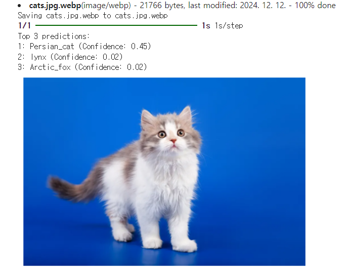

# oss-Project-202434613
OpenSourceSW termProject group49
## 202434613 박재욱

## 이미지 파일을 업로드받아 이미지에 어떤 물체가 있는지 파악함.

## 프로젝트 이미지 예 (고양이 이미지)
<table>
  <tr>
    <td></td>
    <td></td>
  </tr>
</table>
이처럼 머신러닝 데이터를 사용하여 이미지 내의 물체를 파악하고 예상 정확도와 함께 표시한다.

## 사용한 라이브러리
- Huggingface

## 실행 방법
image_path = 'path_to_your_image.jpg' 이 코드의 ''내에 로컬 이미지 파일 경로를 제시한 후 실행하면 된다.

*로컬 Python 환경에서 실행하려면 TensorFlow와 OpenCV 설치가 필요*

## 참고자료
https://huggingface.co/tasks/object-detection
https://smartplatform.tistory.com/entry/%EC%9D%B4%EB%AF%B8%EC%A7%80%EB%84%B7ImageNet-%EC%9D%B4%EB%9E%80
