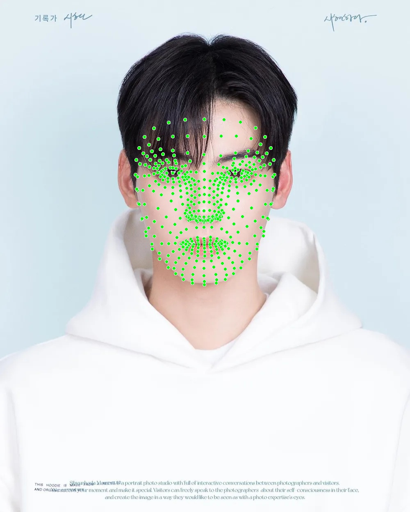
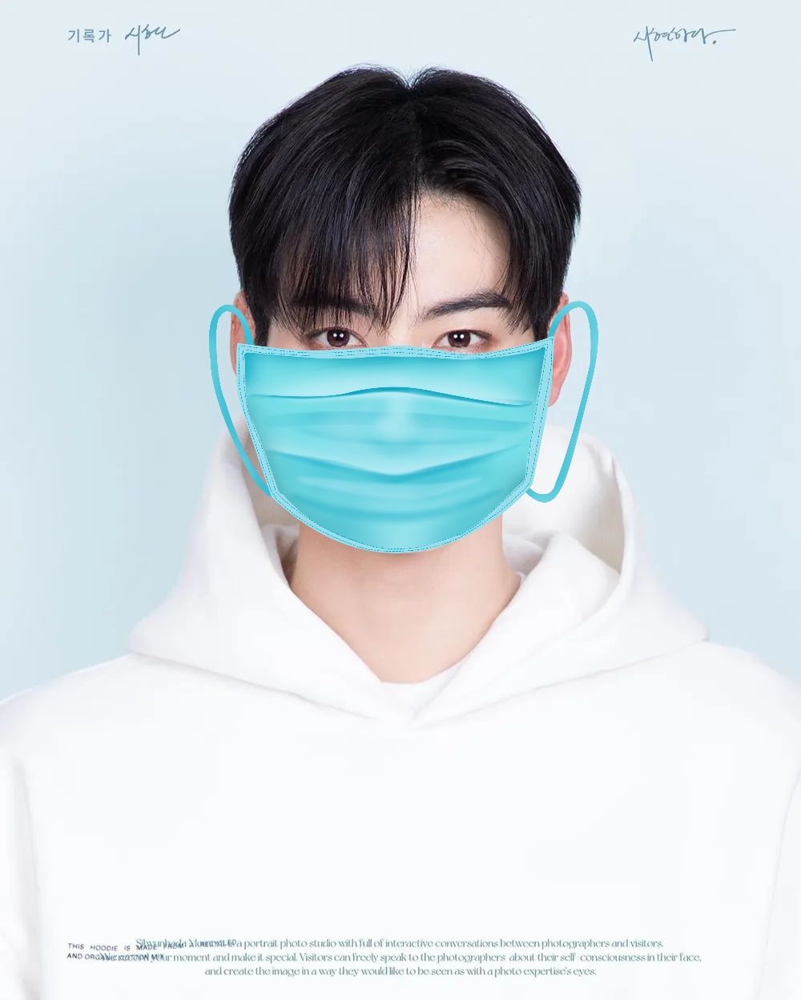
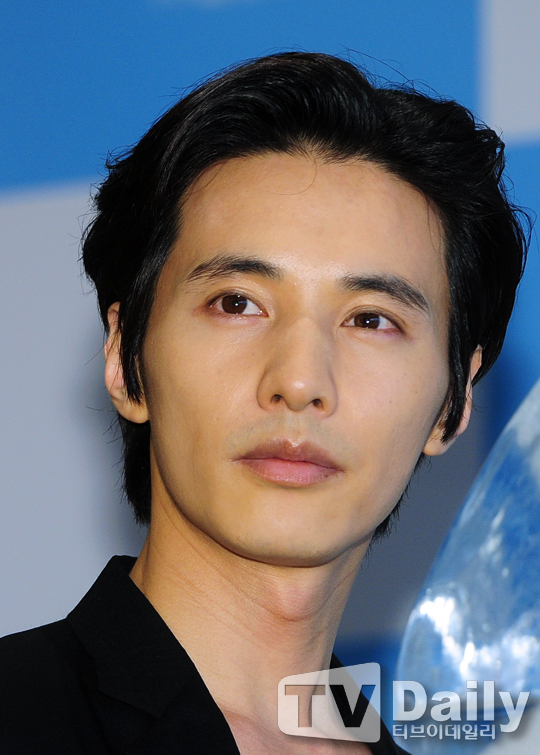
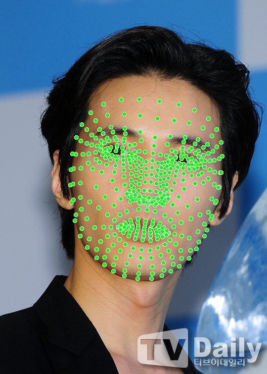
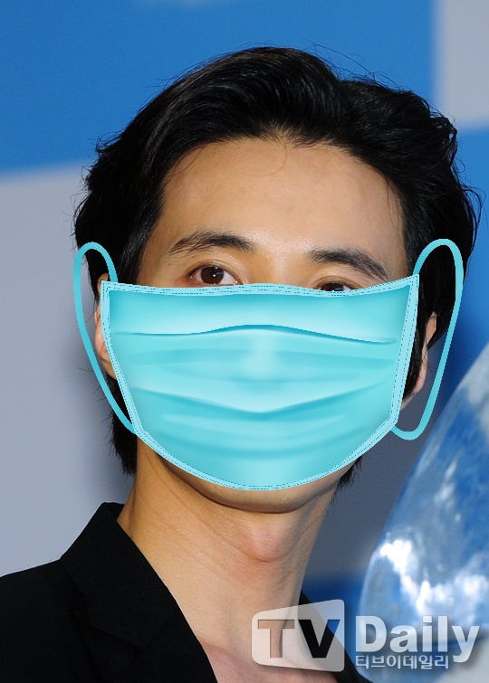

# 202434616 Parkjinyoung
### 사진을 입력하고 얼굴을 분석하여 알맞은 위치에 적절한 크기로 마스크를 이미지에 배치합니다.
## 프로젝트 이미지 예시
<table>
  <tr>
    <td></td>
    <td></td>
    <td></td>
  </tr>
  <tr>
    <td></td>
    <td></td>
    <td></td>
  </tr>
</table>

## 사용한 라이브러리
- openCV
- mediapipe

## 실행방법
이미지와 마스크이미지를 같은파일에 놓은 후에
image = cv2.imread("image2.jpg")
mask_image = cv2.imread('mask.png', cv2.IMREAD_UNCHANGED)
여기서 이미지 주소를 수정하고 실행하면 됩니다.
현재 폴더에 있는 이미지로 바로 실행하면 테스트 가능

## 참고자료
https://puleugo.tistory.com/5
https://github.com/google-ai-edge/mediapipe/blob/master/docs/solutions/face_mesh.md
https://www.sanlab.me/blog/mediapipe-facemesh